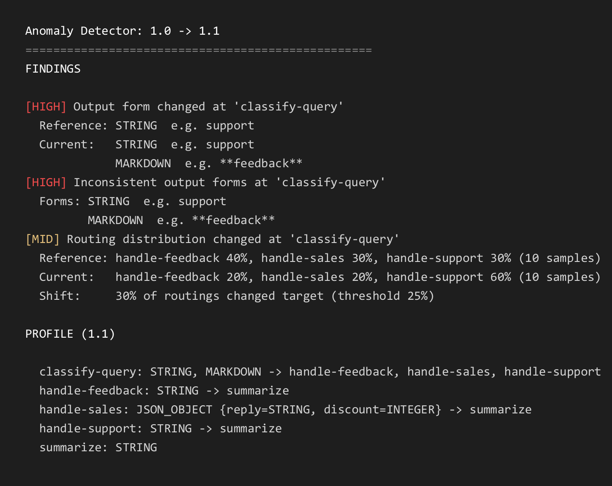

# AI Anomaly Detector

Detect structural and behavioural drift in LLM workflow outputs between two versions of your app.

## Quickstart

Needs git and a JDK (the build downloads JDK 21 by itself if it is missing). No API key, no network calls, same output every run.

```
git clone https://github.com/minogin/ai-anomaly-detector.git
cd ai-anomaly-detector
./gradlew -q demo
```

This runs a small synthetic customer-chat workflow with a scripted stand-in for the model, records four versions of it, and prints one drift report per changed version. In the first report, version 1.1, the router started answering `**feedback**` instead of `feedback` for some messages. The parser did not recognise the bold form and quietly fell back to the support branch:



The image is rendered by the demo itself (`./gradlew -q :demo:screenshots`) at slide resolution; the terminal output is the same text.

The other two reports show a JSON field being nested inside a new object (1.2), and a branch of the workflow silently disappearing (1.3). One version at a time:

```
./gradlew -q :demo:record-1.0    # baseline
./gradlew -q :demo:record-1.1    # drifted
./gradlew -q :demo:diff-1.1      # report 1.1 against 1.0
```

The demo lives in [`demo/`](demo/src/main/kotlin/com/minogin/anomaly/demo). Everything in it is invented: the workflow, the messages, the model's answers.

## The Problem

AI workflows can silently break when you change a prompt, model, or code. The output may still look reasonable to a human, but its structure or behaviour has changed. A JSON object becomes a quoted string, a field gets added or removed, a classifier starts returning markdown instead of a bare word, a router sends traffic somewhere else. Downstream code that parses these outputs then breaks without an obvious error, or keeps running with the wrong branch.

Real examples confirmed by developers:

- `{"riskLevel":"HIGH"}` became `"{\"riskLevel\":\"HIGH\"}"` (JSON got quoted)
- `APPROVE` became `**APPROVE**` (bare word became markdown bold)
- `{"status":"ok","count":3}` became `{"result":{"status":"ok","count":3}}` (fields wrapped in a new object)

## How It Works

Instrument your workflow with checkpoints:

```kotlin
val detector = AnomalyDetector(
    basePath = ".ai-anomaly-detector",
    currentVersion = "1.1",
)

// wrap LLM calls
val response = llm.call(prompt)
detector.checkpoint(step = "classify-query", input = prompt, output = response.content)

// record which branch the app actually took
val handler = route(response.content)
detector.nextStep(step = "classify-query", nextStep = handler)
```

Checkpoints are written to disk immediately after each call, one file per version. Run your app as version `1.0` to record a baseline, then bump to `1.1` and run again. Compare with the CLI:

```
java -jar anomaly-detector-cli.jar .ai-anomaly-detector 1.1 1.0
```

or from code with `detector.report(referenceVersion = "1.0")`.

## What It Detects

| Severity | Finding | Meaning |
|---|---|---|
| HIGH | Output form changed | A step's output type changed: `STRING` became `MARKDOWN`, `JSON_OBJECT` became `quoted(JSON_OBJECT)`, and so on |
| HIGH | JSON schema changed | Same type, different shape: a field added, removed, renamed, nested, or its type changed. Lists the fields |
| HIGH | Inconsistent output forms | One step produces several output types within a single version |
| MID | Transitions changed | A step now routes to a target it never used, or no longer routes to one it used. Shows both distributions |
| MID | Step missing | A step present in the baseline is never visited in the current version |
| MID | Routing distribution changed | Same targets, but the share of traffic going to each moved beyond a threshold. See below |
| LOW | New step | A step not present in the baseline |

### Routing distribution and the threshold

Every other finding is a yes/no question. This one needs a threshold, and thresholds are where drift detection gets hard, so here is exactly what it does.

For one step, the tool counts how often it routed to each target in each version and turns the counts into shares. The measure of change is the share of routings that now end up at a different target than before: add up the absolute difference per target and halve it. It runs from 0 (identical) to 1 (nothing goes where it used to).

Example: 30% / 30% / 40% becoming 60% / 20% / 20% is (30 + 10 + 20) / 2 = 30%.

The check only runs when three conditions hold, each configurable:

| Setting | Default | Why |
|---|---|---|
| threshold | 0.25 | A quarter of the traffic changed destination. With ten samples per version one or two flipped routings stay quiet and three fire. Lower it for high-traffic steps where a few percent matter |
| minimum samples per version | 5 | With fewer, one conversation is a large share by itself and proportions are noise |
| maximum distinct targets | 10 | With many targets each carries a small share and the measure stays small even when routing changed a lot. The check is skipped rather than reporting something meaningless |

Two things this finding deliberately does not do:

- It does not fire when a target appears or disappears. That is a set change, reported by "transitions changed" regardless of any threshold, so a branch that carried 1% of traffic and now carries none is still reported. Keeping the two apart means one change is never reported twice.
- It does not look at output text. Routing targets are what the app actually did after parsing, so the check is immune to formatting noise like `feedback` versus `**feedback**` and sees a fallback branch swallowing traffic.

Settings go on the API via `AnalyzerConfig`, or on the CLI:

```
java -jar anomaly-detector-cli.jar .ai-anomaly-detector 1.1 1.0 \
    --routing-threshold=0.1 --routing-min-samples=20 --routing-max-targets=6
```

### Example outputs in the report

Each output form in a finding is shown with one example, the first output of that form the step
produced, cut to 60 characters:

```
[HIGH] Output form changed at 'classify-query'
  Reference: STRING  e.g. support
  Current:   STRING  e.g. support
             MARKDOWN  e.g. **feedback**
```

Examples are your recorded outputs. If a report must not carry that text, turn them off with
`--no-examples` on the CLI or `AnalyzerConfig(includeExamples = false)` in code; the findings then
contain no output text at all. This affects the report only: the checkpoint files under
`.ai-anomaly-detector/` always contain every input and output in full, so treat that directory as
you would treat logs.

## Output Classification

Outputs are classified by structural type before comparison:

| Type | Example |
|------|---------|
| `JSON_OBJECT` | `{"riskLevel":"HIGH"}` |
| `JSON_ARRAY` | `[{"id":1},{"id":2}]` |
| `INTEGER` | `42` |
| `DECIMAL` | `0.95`, `1e10` |
| `STRING` | `APPROVE` |
| `MARKDOWN` | `**APPROVE**`, `# Report`, `- item` |
| `HTML` | `<p>text</p>` |
| `quoted(...)` | `"42"`, `"{\"key\":\"value\"}"` |

For JSON objects and arrays the schema (field names and value types, recursively) is captured from the observed values and compared, so `{"status":"ok"}` and `{"result":"ok"}` are treated as different even though both are `JSON_OBJECT`.

## Installation

Via [JitPack](https://jitpack.io/#minogin/ai-anomaly-detector):

```kotlin
repositories {
    mavenCentral()
    maven("https://jitpack.io")
}

dependencies {
    implementation("com.github.minogin:ai-anomaly-detector:0.3.0")
}
```

Or build it yourself and publish to your local Maven repository:

```
./gradlew publishToMavenLocal
```

```kotlin
dependencies {
    implementation("com.minogin:anomaly-detector:0.3.0")
}
```

The standalone CLI jar is built with `./gradlew cliJar` and lands in `build/libs/`.

## What It Is Not

- Not an agent framework. No workflow restructuring required, just checkpoints around your model calls.
- Not a correctness judge. It reports that something changed, not whether the change is good or bad.
- Not a semantic analyser. Structural and routing drift only; the meaning of the text is never inspected.
- Not useful on the first run. It compares two recorded versions, so there is nothing to report until a baseline exists.
- Not a statistics tool. The routing check needs a handful of samples per version and is skipped below that, so a step visited twice a day will only ever get the yes/no findings.

## Status

Early prototype (0.3.x). Core detection works and has caught real bugs. The demo above is the recommended way to see what a report looks like before instrumenting your own workflow.
